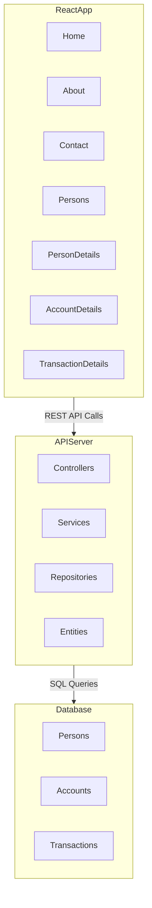
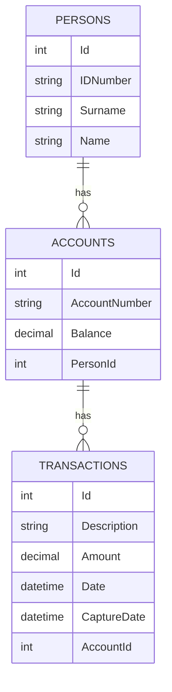
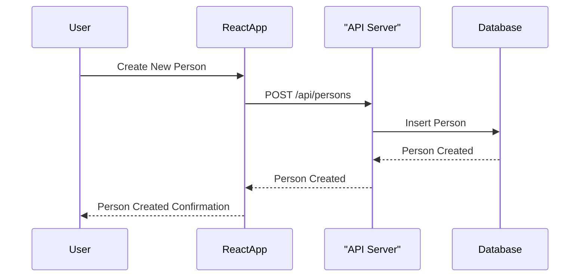
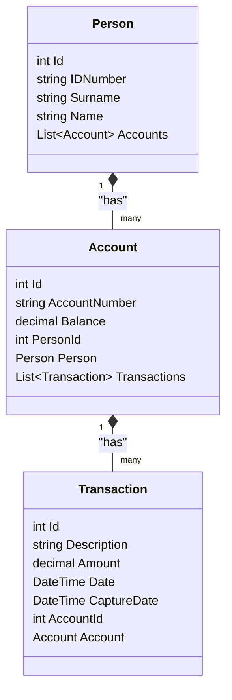

# TVA Account Management Application

## Overview
This Single Page Application (SPA) is designed to manage people, their accounts, and transactions logged against these accounts. The frontend is developed using React, and the backend is a .NET Core Web API following Clean Architecture principles.

## Features
- **Home Page**: Displays a welcome message with a brief description of the application.
- **About Page**: Provides information about the application and the developer.
- **Contact Page**: Displays contact information.
- **Persons List Page**: Displays a list of persons with options to edit or delete and provides search functionality.
- **Person Details Page**: Allows viewing and editing of person details and adding new accounts.
- **Account Details Page**: Allows viewing and editing of account details and adding new transactions.
- **Transaction Details Page**: Allows viewing and editing of transaction details with a DatePicker for the transaction date.

## Validation and Business Rules
### Persons
- A person can only be created once with the same ID Number.
- A person can have an unlimited number of accounts.
- Only persons with no accounts or where all accounts are closed may be deleted.

### Accounts
- Duplicate account numbers are not allowed.
- New accounts can only be added after the person is created.
- The user is never allowed to change the account's outstanding balance.
- An account can have an unlimited number of transactions.
- The outstanding balance for the account must be updated whenever a new transaction is added, or an existing transaction is modified.
- Accounts cannot be closed if the balance is not zero.
- Transactions cannot be posted to closed accounts.

### Transactions
- The transaction date can never be in the future.
- New transactions can only be added after the account is created.
- The user is never allowed to change the capture date.
- Users may enter debit or credit amounts for a transaction.
- The transaction amount can never be zero (0).

## Setup Instructions

### Prerequisites
- Node.js and npm
- .NET Core SDK
- Microsoft SQL Server

### Frontend Setup
1. Clone the repository:
  ```bash
  git clone https://github.com/your-repo/account-management-spa.git
  cd account-management-spa
  ```

2. Install dependencies:
  ```bash
  npm install
  ```

3. Start the development server:
  ```bash
  npm start
  ```

### Backend Setup
1. Navigate to the backend project directory:
  ```bash
  cd AccountManagementAPI
  ```

2. Install dependencies:
  ```bash
  dotnet restore
  ```

3. Update the connection string in `appsettings.json`:
  ```json
  {
    "ConnectionStrings": {
     "DefaultConnection": "Server=your_server;Database=AccountManagementDB;Trusted_Connection=True;MultipleActiveResultSets=true"
    },
    "Logging": {
     "LogLevel": {
      "Default": "Information",
      "Microsoft": "Warning",
      "Microsoft.Hosting.Lifetime": "Information"
     }
    },
    "AllowedHosts": "*"
  }
  ```

4. Run the database migrations to set up the database:
  ```bash
  dotnet ef database update
  ```

5. Run the application:
  ```bash
  dotnet run
  ```

### API Documentation
The API endpoints can be tested using the provided Postman collection. Import the collection into Postman and use the available requests to interact with the API.

## Diagrams
The following diagrams provide a visual representation of the system:

### Architecture Diagram
The architecture diagram illustrates the interaction between the React frontend, the API server, and the database. The React application communicates with the API server via REST API calls, and the API server interacts with the database using SQL queries.



### Entity Relationship (ER) Diagram
The ER diagram shows the relationships between the entities in the system. Each person can have multiple accounts, and each account can have multiple transactions.



### Sequence Diagram
The sequence diagram depicts the flow of creating a new person in the system. It shows the interactions between the user, the React application, the API server, and the database.



### Class Diagram
The class diagram provides a detailed view of the classes in the system and their relationships. It includes the `Person`, `Account`, and `Transaction` classes, along with their attributes and associations.



## License
This project is licensed under the MIT License.