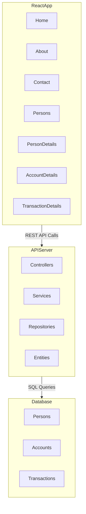
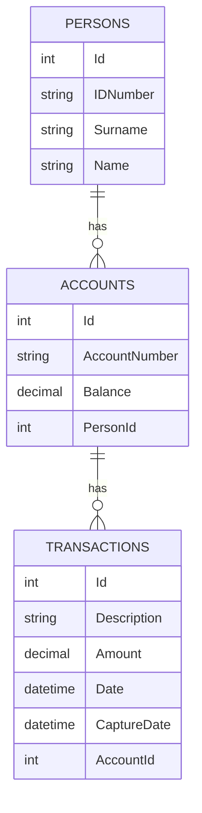
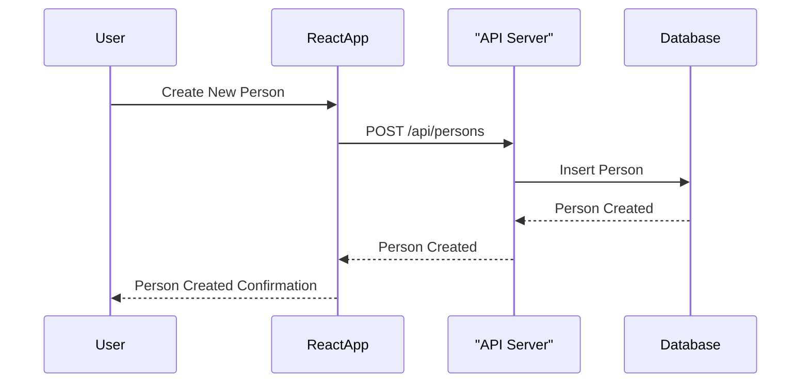
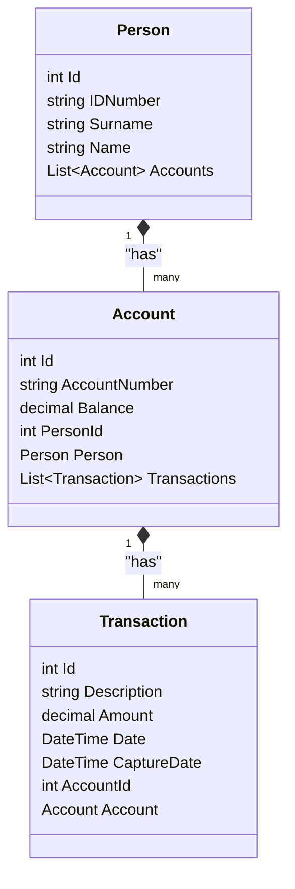

## Diagrams
The following diagrams provide a visual representation of the system:
NB drop in browser for rich rendering if you dont have the mermaid extension installed or the vscode preview not displaying diagrams.

### Architecture Diagram
The architecture diagram illustrates the interaction between the React frontend, the API server, and the database. The React application communicates with the API server via REST API calls, and the API server interacts with the database using SQL queries.

### Entity Relationship (ER) Diagram
The ER diagram shows the relationships between the entities in the system. Each person can have multiple accounts, and each account can have multiple transactions.

### Sequence Diagram
The sequence diagram depicts the flow of creating a new person in the system. It shows the interactions between the user, the React application, the API server, and the database.

### Class Diagram
The class diagram provides a detailed view of the classes in the system and their relationships. It includes the `Person`, `Account`, and `Transaction` classes, along with their attributes and associations.

## License
This project is licensed under the MIT License.